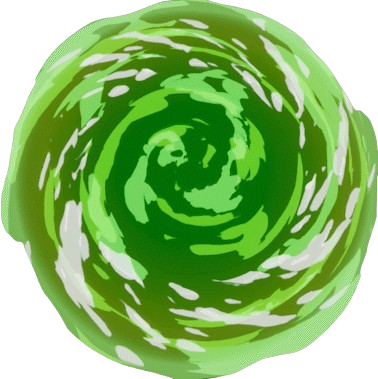

# Universe-C137

## [See the App!](https://universe-c137.netlify.app/)

## Description

This web application is dedicated to the Rick and Morty universe. Here you can explore a list of characters from the series, and you also have the option to add, edit or delete custom variations of these characters.

#### [Client Repo here](https://github.com/alvarox86/UniverseC137)

#### [Server Repo here](https://github.com/alvarox86/json-server-UniverseC137)

## Technologies, Libraries & APIs used

- Html
- Css
- JavaSrcipt
- React
- Mui
- Axios

# Client Structure

## User Stories

- **404** - An error page that is displayed when what is being searched for does not exist.

- **HomePage** - A page showing a list of the characters of the series provided by the [API](https://rickandmortyapi.com/documentation/#get-all-characters).

- **AboutPage** - A page talking a little about myself and the site.

- **CharacterDetails** - A page where you can see the details of the characters you have selected and where you can see the variations introduced by users. You will also be able to add new variations to park them.

- **VariantsDetails** - A page where you can see the details of the variations and where you can edit the data in case what is entered is incorrect.

## Client Routes

## React Router Routes (React App)

| Path                             | Page             | Components              | Behavior                              |
| -------------------------------- | ---------------- | ----------------------- | ------------------------------------- |
| `/`                              | Home             |                         | Home page                             |
| `/CharacterList`                 | Home             | CharacterCard,SearchBar | List of the characters                |
| `/CharacterDetails/:CharacterId` | CharacterDetails | VariantCard             | Details and info about the character  |
| `/VariantDetails/:VariantId`     | VariantDetails   |                         | Details and info about the variation  |
| `/AboutPage`                     | AboutPage        |                         | Page about the page and the developer |

## Other Components

- Navbar
- Sidebar

## Links

### Collaborators

[Álvaro Ruiz Monfillo](https://github.com/alvarox86)

### Project

[Repository Link Client](https://github.com/alvarox86/UniverseC137)

[Repository Link Server](https://github.com/alvarox86/json-server-UniverseC137)

[Deploy](https://universe-c137.netlify.app/)

### WireFrame

[Wireframe on excalidraw](https://excalidraw.com/)

### Slides

[Slides](https://www.canva.com/design/DAGo68SNJ9A/nVVfmbr74MPrRnoJDhoQkw/edit?utm_content=DAGo68SNJ9A&utm_campaign=designshare&utm_medium=link2&utm_source=sharebutton)
